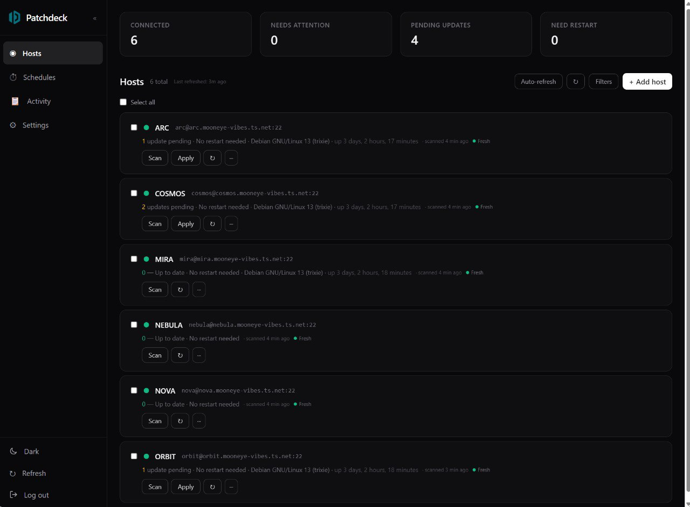
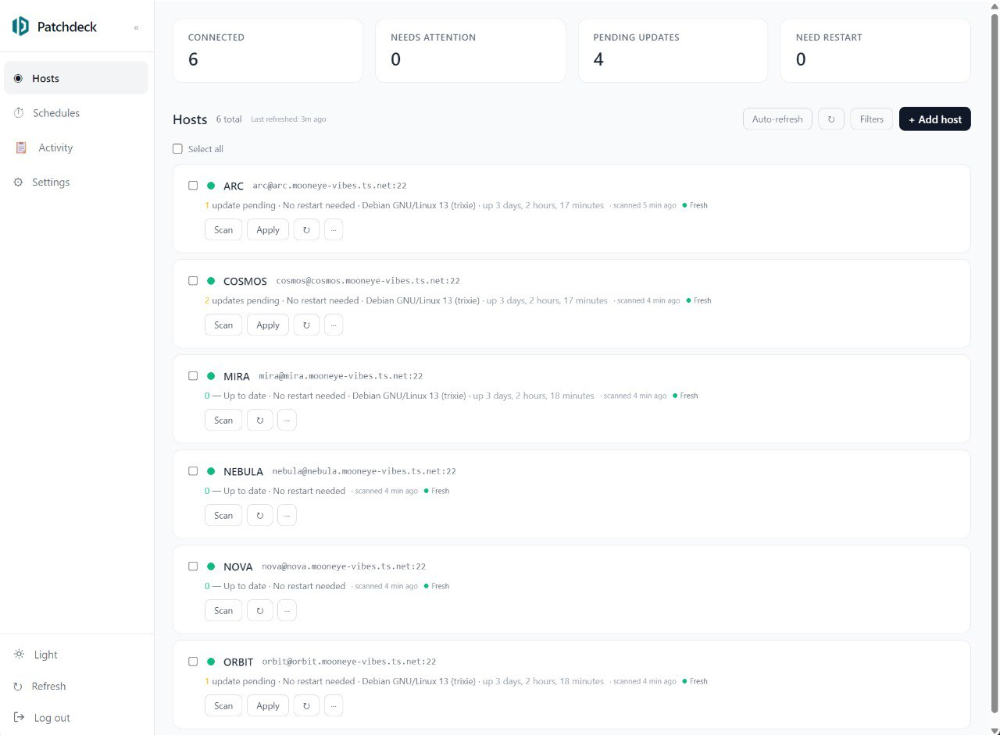
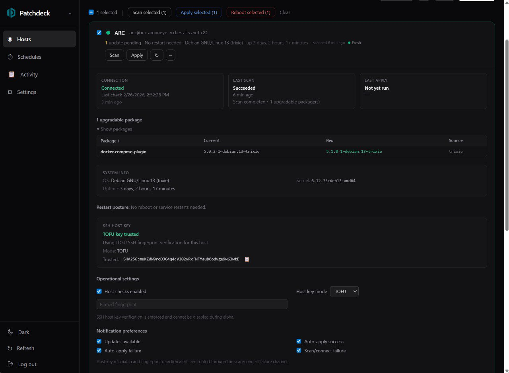
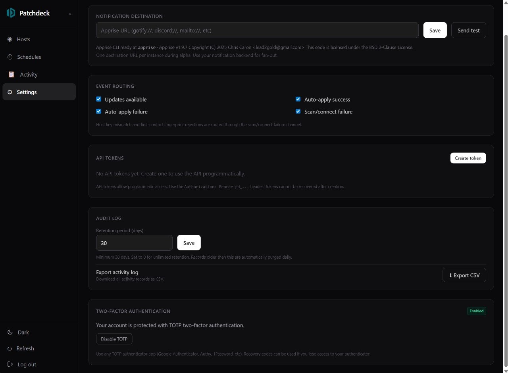

<p align="center">
  
</p>

<h1 align="center">Patchdeck</h1>

<p align="center">
  <strong>Agentless patch management dashboard for Debian &amp; Ubuntu servers.</strong>
</p>

<p align="center">
  <a href="#quick-start">Quick Start</a> · <a href="#features">Features</a> · <a href="#configuration">Configuration</a> · <a href="#api">API</a> · <a href="#development">Development</a>
</p>

<p align="center">
  
  
  
  
</p>

---

Patchdeck gives you a single pane of glass over your Linux fleet's patch status — scan for updates, apply them, restart services, and schedule recurring maintenance. No agents to install on your hosts — just SSH.

Built for homelabbers, sysadmins, and small teams who want visibility without enterprise complexity.

## Features

- **Agentless scanning** — connects over SSH, no agents to deploy or maintain
- **One-click patching** — apply `apt` updates with real-time streaming output
- **Service restart & reboot** — restart specific services or reboot/shutdown hosts from the UI
- **Reboot detection** — surfaces `/var/run/reboot-required` with package-level detail
- **Scheduled maintenance** — cron-based schedules with multi-host and tag-group targeting
- **Host tagging & grouping** — organize hosts by environment, role, or location
- **Activity audit log** — full timeline of scans, applies, reboots, and config changes with configurable retention and CSV export
- **Notifications** — Apprise-powered alerts to Gotify, Telegram, Discord, email, and [80+ services](https://github.com/caronc/apprise)
- **SSH host key verification** — TOFU + manual pinning with full audit trail
- **API tokens** — programmatic access with `Bearer` auth
- **Dark & light themes** — system preference detection with manual toggle
- **Mobile responsive** — works on phones and tablets
- **Two-factor auth** — optional TOTP (Google Authenticator, Authy, etc.) on admin login
- **Encrypted secrets** — AES-GCM at rest for all SSH credentials

## Screenshots

<p align="center">
  
</p>

<p align="center">
  
</p>

<p align="center">
  
</p>

<p align="center">
  
</p>

> Mobile screenshots coming soon.

## Quick Start

### Prerequisites

- Docker & Docker Compose
- SSH access to your target hosts (password or key auth)

### 1. Create your project directory

```bash
mkdir patchdeck && cd patchdeck
```

### 2. Create your `.env` file

```bash
# Generate secure keys
echo "PATCHDECK_MASTER_KEY=$(openssl rand -hex 32)" > .env
echo "PATCHDECK_JWT_SECRET=$(openssl rand -hex 32)" >> .env
```

Or copy the example and edit manually:

```bash
cp .env.example .env
```

`.env.example`:
```env
# Required: 32+ chars each
PATCHDECK_MASTER_KEY=replace-with-32plus-char-random-string
PATCHDECK_JWT_SECRET=replace-with-another-32plus-char-random-string
```

### 3. Create your `compose.yaml`

```yaml
services:
  patchdeck:
    image: ghcr.io/roydufek/patchdeck:latest
    container_name: patchdeck
    restart: unless-stopped
    ports:
      - "6070:6070"
    environment:
      PUID: 1000                                         # default, set to match your host user
      PGID: 1000                                         # default, set to match your host group
      PATCHDECK_PORT: 6070
      PATCHDECK_MASTER_KEY: ${PATCHDECK_MASTER_KEY}
      PATCHDECK_JWT_SECRET: ${PATCHDECK_JWT_SECRET}
      #PATCHDECK_DB_PATH: /data/patchdeck.db            # default, optional
      #PATCHDECK_SSH_TIMEOUT_SECONDS: 20                 # default, optional
      #REGISTRATION_ENABLED: true                        # default, optional
      #PATCHDECK_APPRISE_TIMEOUT_SECONDS: 10             # default, optional
      #PATCHDECK_APPRISE_BIN: /usr/local/bin/apprise     # default, optional — override only if apprise binary is not in bin
      #PATCHDECK_APPRISE_URL: tgram://bot_token/chat_id  # optional
    volumes:
      - ./data:/data
```

### 4. Start

```bash
docker compose up -d
```

Patchdeck will be available at `http://localhost:6070`.

### 5. Create your admin account

Open the web UI and complete the setup wizard to create your admin account with optional TOTP two-factor auth.

### 6. Add hosts

Click **Add Host** and enter your server's SSH connection details. Patchdeck encrypts all credentials at rest.

## Building from Source

```bash
git clone https://github.com/roydufek/patchdeck.git
cd patchdeck
cp .env.example .env
# Edit .env with your secrets
docker compose up -d --build
```

## Stack

| Component | Technology |
|-----------|-----------|
| Backend | Go (Chi router + SQLite) |
| Frontend | React 18 + Vite + Tailwind CSS |
| Notifications | Apprise CLI (bundled in image) |
| Deployment | Docker Compose (single container) |

## Configuration

All configuration is via environment variables. Only `PATCHDECK_MASTER_KEY` and `PATCHDECK_JWT_SECRET` are required — everything else has sensible defaults.

| Variable | Required | Default | Description |
|----------|----------|---------|-------------|
| `PUID` | | `1000` | User ID for the container process (linuxserver.io convention) |
| `PGID` | | `1000` | Group ID for the container process (linuxserver.io convention) |
| `PATCHDECK_MASTER_KEY` | ✅ | — | 32+ char string for AES-GCM credential encryption |
| `PATCHDECK_JWT_SECRET` | ✅ | — | 32+ char string for JWT signing |
| `PATCHDECK_DB_PATH` | | `/data/patchdeck.db` | SQLite database path inside the container |
| `PATCHDECK_SSH_TIMEOUT_SECONDS` | | `20` | SSH connection timeout |
| `PATCHDECK_APPRISE_TIMEOUT_SECONDS` | | `10` | Notification delivery timeout |
| `PATCHDECK_APPRISE_BIN` | | `apprise` | Path to apprise binary (bundled in image) |
| `PATCHDECK_APPRISE_URL` | | — | Default Apprise destination URL |
| `REGISTRATION_ENABLED` | | `true` | Set `false` to disable new account registration |

## Architecture

```
┌─────────────┐
│   Browser    │
└──────┬──────┘
       │ :6070
┌──────▼──────────────┐
│  Patchdeck          │
│  ┌───────────────┐  │
│  │ Go API server  │  │
│  │ + static SPA   │  │
│  │ + SQLite       │  │
│  │ + Apprise CLI  │  │
│  │ + Scheduler    │  │
│  └───────┬───────┘  │
└──────────┼──────────┘
           │ SSH
    ┌──────▼──────┐
    │ Your hosts  │
    └─────────────┘
```

## Security

- **Credentials encrypted at rest** — AES-GCM with a 32-byte master key
- **Password hashing** — bcrypt
- **JWT auth** — HS256 with 12-hour TTL
- **TOTP two-factor** — optional time-based one-time password on login
- **SSH host key verification** — TOFU with optional manual pinning; mismatches block operations until resolved
- **Parameterized SQL** — no raw string interpolation
- **Rate limiting** — 30-second per-host cooldown on scan/apply
- **Audit trail** — all operations logged with retention policy

## API

Patchdeck exposes a REST API. Authenticate with either a JWT (from login) or an API token (`Bearer pd_...`).

Key endpoints:

| Method | Endpoint | Description |
|--------|----------|-------------|
| `POST` | `/api/login` | Authenticate (returns JWT) |
| `GET` | `/api/hosts` | List all hosts |
| `POST` | `/api/hosts` | Add a host |
| `POST` | `/api/hosts/:id/scan` | Scan a host for updates (SSE stream) |
| `POST` | `/api/hosts/:id/apply` | Apply updates (SSE stream) |
| `POST` | `/api/hosts/:id/power` | Reboot or shutdown |
| `GET` | `/api/activity` | Activity log (paginated) |
| `GET` | `/api/activity/export` | Export activity as CSV |
| `GET/POST` | `/api/jobs` | List/create scheduled jobs |
| `GET/PUT` | `/api/settings/*` | Notification, audit, and token settings |

Full API documentation is planned for a future release.

## Development

```bash
# Backend
cd api
go build ./...
go test ./...

# Frontend
cd web
npm install
npm run dev    # Dev server with HMR
npm run build  # Production build
```

## Roadmap

- [ ] Webhooks for external integrations
- [ ] Role-based access control (RBAC)
- [ ] Multi-user management
- [ ] RPM/dnf support (RHEL, Fedora, Rocky)
- [ ] Notification log with delivery status
- [ ] Dashboard metrics and charts

## License

[MIT](LICENSE)

## Contributing

Patchdeck is in early development. Issues and pull requests are welcome.
